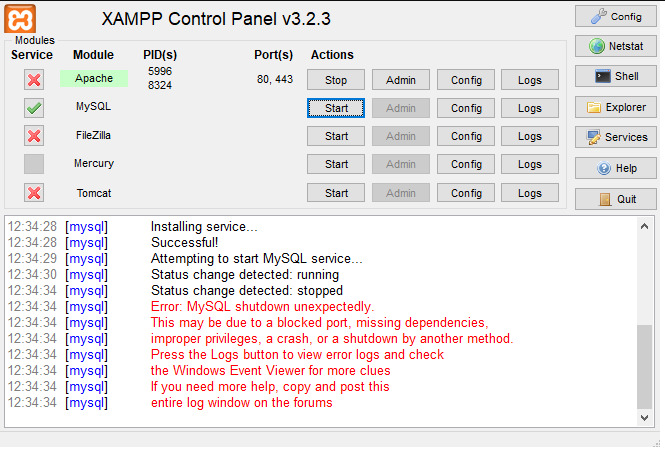
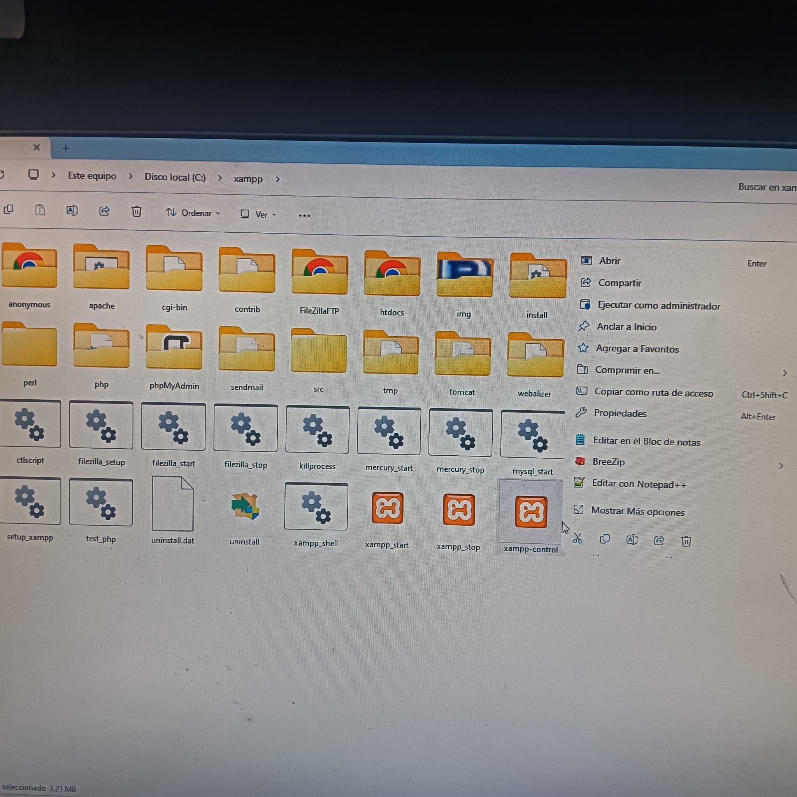
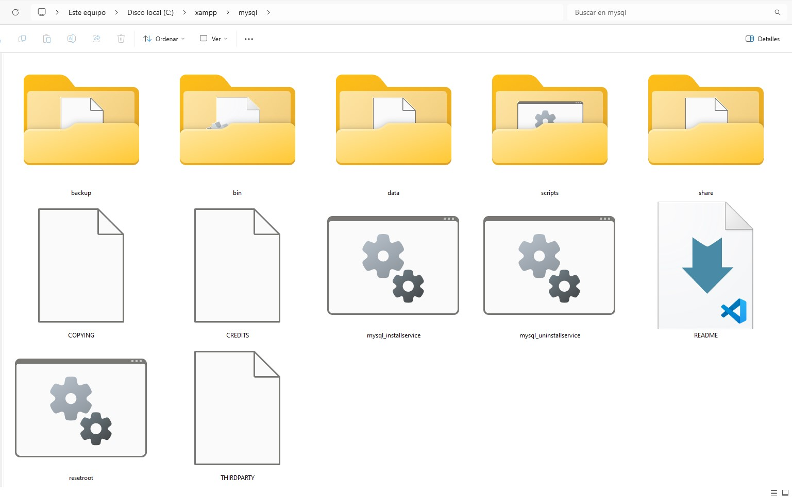
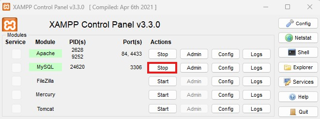
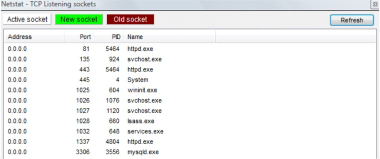
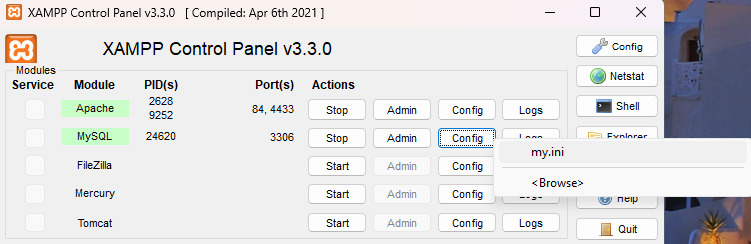
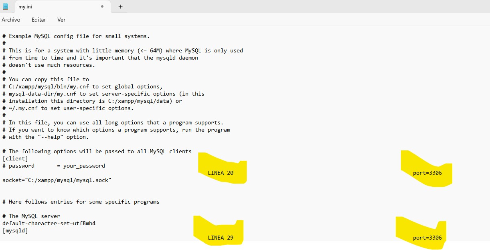

# FIXED-MYSQL-XAMPP
## Guía de ayuda para la reparación de la conexión local con el servicio MYSQL de phpMyAdmin - XAMPP.

Es el mensaje que se verá si el software MySQL en tu entorno se apaga o deja de funcionar "inesperadamente", porque puedes cerrar manualmente el software de la base de datos MySQL en cualquier momento. Eso también ocurre cuando reinicias tu servidor.

### VER   IMAGEN    >>  a  <<

Arreglar el error de XAMPP «MySQL shutdown unexpectedly» es rápido y fácil. A continuación, dejo una pequeña guía con la que, junto con las capturas hechas durante el proceso de recuperación, puede resolverse el problema, sin tener que perder la información de bases de datos de proyectos ya existentes.

### 1. Ejecuta XAMPP Utilizando Privilegios de Administrador.

XAMPP produce errores cuando no se ejecuta el software utilizando privilegios de administrador. Se debe a que sus componentes pueden no ser capaces de funcionar o configurarse correctamente con niveles de permiso inferiores. Si no se está totalmente seguro de que así sea la configuración, proceder a cerrar XAMPP por completo y reiniciar el entorno como administrador. En Windows, se debe buscar la ruta de ubicación del directorio donde quedó instalado XAMPP. Una vez localizado, habrá que seleccionar uno de los archivos internos del directorio:

## >> xampp-control <<

A continuación, ejecutar en modo administrador, clickando con el botón secundario del ratón para desplegar la lista de opciones/herramientas útiles sobre el archivo.

### VER   IMAGEN    >>  b  <<

Un usuario de macOS, puede hacer clic con el botón derecho del ratón en la carpeta y seleccionar Obtener información. En la ventana emergente que se abre, ver sección Compartir y permisos, clickar en el icono del candado e introducir la contraseña de administrador. Cambiar la configuración de los permisos de lectura y escritura a Todos.

### 2. Restaura la Copia de Seguridad de la Base de Datos.

Si reiniciar XAMPP con privilegios de administrador no resuelve el problema con el servicio gestor de base de datos, el siguiente paso es restaurar desde la backup. XAMPP crea automáticamente copias de seguridad para el software del propio entorno, a las que se puede acceder desde el directorio donde se instaló XAMPP.

Por defecto, los archivos de copia de seguridad de MySQL de XAMPP deberían estar en Disco Local > XAMPP > MySQL. Dentro de ese directorio, existen varias subdirectorios, dos de los cuales se llaman 

## >> DATA y BACKUP <<.

### VER   IMAGEN    >>  c  <<

La carpeta de datos incluye todos los archivos que utiliza tu base de datos. La carpeta de copia de seguridad contiene una única copia reciente de tu MySQL.

Antes de restaurar los archivos de copia de seguridad, desde el panel de control de XAMPP se debe detener el software de MySQL, haciendo clic en el botón Stop a la derecha de la opción MySQL en el menú principal.

### VER   IMAGEN    >>  d  <<

#### 1. Para restaurar la copia de seguridad de MySQL, cambiar el nombre del directorio  >>>>   data   <<<<   por cualquier otro, como data-old. 
#### 2. Luego renombrar el directorio de la copia de seguridad a data.

### 3. Cambiar el Puerto de MySQL.

Una de las causas más comunes del error de XAMPP «MySQL shutdown unexpectedly» es otro software que utiliza el puerto asignado a MySQL. Por defecto, suele ser el 3306. Para asegurarlo, seleccionar el módulo Netstat desde el panel de control de XAMPP, justo encima de la herramienta Shell:

Netstat es una herramienta de línea de comandos que puede mostrar las conexiones activas en la red, incluyendo los puertos que se están utilizando. Una vez iniciado Netstat, se podrá ver qué puerto está usando cada herramienta de la pila, incluyendo MySQL.

### VER   IMAGEN    >>  e  <<

Si un conflicto con ese puerto causó el cierre, restaurar una copia de seguridad o ejecutar MySQL con privilegios de administrador no hará ninguna diferencia. La única manera de resolver este problema es cambiar el puerto que usa MySQL. por medio del software Netstat, puede verse cuál es ese puerto en conflicto y cuáles otros están en uso.

Para ello, se debe parar el servicio de MYSQL, utilizando el mismo proceso de apagado ya explicado. A continuación, clickar en el botón Config junto a MySQL en el menú principal de XAMPP, y luego selecciona la opción my.ini:

### VER   IMAGEN    >>  f  <<

El archivo my.ini contiene los ajustes de configuración de MySQL. Después de hacer clic en él, XAMPP abrirá el archivo utilizando tu editor de texto predeterminado. Una vez dentro, busca la línea que dice Port, que especifica el número de puerto que usa MySQL.

Aquí, puedes cambiar ese número de puerto a otra opción que sepas que otros programas no están usando. En la mayoría de los casos, recomendamos usar 3307, que debería estar disponible. Guarda los cambios y cierra el archivo my.ini.

### VER   IMAGEN    >>  g  <<

Entonces puedes usar el panel de control de XAMPP para reiniciar MySQL. Con suerte, tu base de datos está ahora funcionando como debería. Si por alguna razón, XAMPP no puede conectarse a tu base de datos usando el nuevo puerto que has establecido, te lo hará saber a través del registro del panel de control. En ese caso, puedes intentar usar un puerto diferente.
